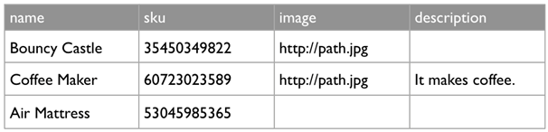
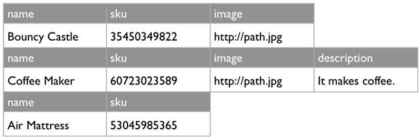

The Nobackend Data Store
------------------------
The Nobackend data store is backed by Cassandra, an open source distributed DBMS. Cassandra isn’t a relational database system (RDBMS), and is sometimes placed in the category of “NoSQL” or “schema-less” databases. 

.. Note::  Nobackend is not a relational database. Optimizing for performance on a non-relational database like Cassandra differs a bit from relational databases. For more information, see :ref:`datastore-practice`.

Cassandra is specifically designed to support applications that need flexibility and high scalability, particularly web and mobile applications. Nobackend client applications write and read data formatted as JavaScript Object Notation (JSON). (Nobackend provides SDKs through which client apps can do much of this work in their native language.

With Cassandra as the underlying DBMS, apps benefit from:

Fast writes to the data store.

*  A distributed architecture that means no single point of failure.
*  Flexibility in data model design. You aren't constrained by a schema.
*  Linear scalability.

If you have experience with relational databases and are unfamiliar with "NoSQL" databases, the following table might be a helpful start. It maps the high-level concepts of an RDBMS’s data model both to Cassandra’s and to the Nobackend, which is backed by Cassandra.

+----------------------------------------+----------------------------+----------------------------------------------------+
|                 RDBMS                  |          Cassandra         |                     Nobackend                      |
+===========================+============+============================+====================================================+
|Each tuple is modeled as   | A row      |A row                       |An entity. Written and retrieved as JSON, an entity |
|                           |            |                            |contains values for all of its properties in the way| 
|                           |            |                            |a row has values for columns.                       | 
+---------------------------+------------+----------------------------+----------------------------------------------------+     
|Each data attribute is     | A column   |A column. Many thousands of |A entity property. An entity has a default set of   |
|modeled as                 |            |columns are supported.      |properties, including the entity’s UUID. You can    | 
|                           |            |                            |add many more to support your application           |
+---------------------------+------------+----------------------------+----------------------------------------------------+
|Each group of attributes is| A Table    |A column family. Unlike rows|An entity collection. As with its underlying        |
|modeled as                 |            |in tables, rows in a column |Cassandra column family, a collection can have      |
|                           |            |family can have differing   |entities with differing numbers of properties. In   |
|                           |            |numbers of columns. Because |other words, just because one entity has an authorId|
|                           |            |you’re not using a schema   |property doesn’t mean that other entities in its    |
|                           |            |to define the model, you    |collection need to                                  |
|                           |            |can update the column list  |                                                    |
|                           |            |for a row at any time.      |                                                    |
+---------------------------+------------+----------------------------+----------------------------------------------------+

The following examples from a product database provide simple illustrations of these differences.

An RDBMS table has a schema-defined set of columns per row.

A Cassandra column family includes rows that can have differing column sets.

In the JSON from the Nobackend application, the products are represented as entities. Note that each entity in the entities array below has a slightly different set of properties, like the columns in a Cassandra column family.

.. code:: java

    {
        "action" : "get", 
        "application" : "<app_uuid>", 
        "params" : {}, 
        "path" : "/products", 
        "uri" : "https://api.tbaas.co/my_org/my_app/products", 
        "entities" : [ { 
            "uuid" : "<product_uuid>", 
            "type" : "product", 
            "created" : 1395410098517, 
            "modified" : 1395410098517, 
            "image" : "http://path.jpg", 
            "metadata" : { 
                "path" : "/products/<product_uuid>" 
            }, 
            "name" : "Bouncy Castle", 
            "sku" : "35450349822" 
        }, 
        {
            "uuid" : "<product_uuid>", 
            "type" : "product", 
            "created" : 1395409669686, 
            "modified" : 1395409669686, 
            "image" : "http://path.jpg", 
            "metadata" : { 
                "path" : "/products/<product_uuid>" 
            }, 
            "description" : "It makes coffee.", 
            "name" : "Coffee Maker", 
            "sku" : "60723023589" 
        }, 
        { 
            "uuid" : "<product_uuid>", 
            "type" : "product",
            "created" : 1395407700578, 
            "modified" : 1395407700578, 
            "metadata" : { 
                "path" : "/products/<product_uuid>" 
            }, 
            "name" : "Air Mattress", 
            "sku" : "53045985365" 
        }],
        "timestamp" : 1396290037640, 
        "duration" : 91, 
        "organization" : "my_org", 
        "applicationName" : "my_app", 
        "count" : 3 
    }