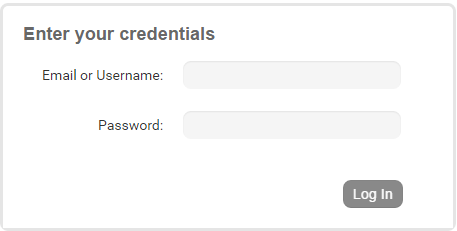

.. _create-account:

Creating a Nobackend Account
----------------------------
To get started using the Nobackend, you'll need an Nobackend account. (Before reading this, you should already be familiar with what Nobackend can do to support your apps. If you're still curious about that, you might want to read Nobackend features first.)

To create a Nobackend account and log in:

1. Go to https://nobackend.id/portal/#!/login and click **Register**.
	* The Username is the name you want for your organization. Use only alphanumeric characters. You'll have one opportunity to change this name in the steps below before the organization is created.
2. Enter the required info.
3. Click **Register**.
4. **Important**: In the email you receive, click the link to verify your email.
5. After you click the email link, go to the login page (https://nobackend.id/portal/#!/login ). Log in with the email and password you used to sign up.

6. After you log in, you're taken to the account dashboard: https://nobackend.id/portal/#!/org-overview 
7. On the accounts dashboard, a **New Application** dialog will appear, you can create new application directly or you can close, then you can create new again for clicking **Add New App** button.

With an account, you get the following useful things:

* A sandbox application you can try things with (we automatically create one for you with your new account). The sandbox is a partitioned area of the data store where you can add example data and try out API calls. The sandbox isn't secure, but it's handy to play in. For more about the sandbox, see :ref:`using-sandbox`.
* The ability to create more applications (in addition to the sandbox). You can (and should!) make these as secure as you need to. These are the applications that you'll have behind the apps you make available to your users.
* Access to the Admin Portal. In the portal, you can do the following:
    * Create and manage applications.
    * Manage your app's users, including access levels.
    * Manage the data in your app.
    * Manage app features, including push notifications, activities, analytics, and so on.
    * Try out API calls with a shell command window.
    * To create an Nobackend account and see a very short tutorial to get started with, go to the get started page of the Portal.