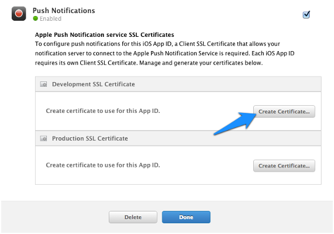
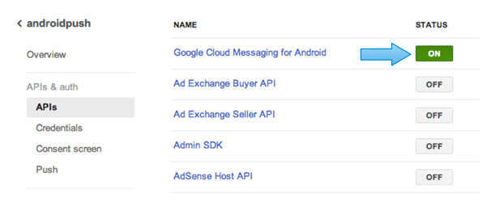

Registering with a notification service
---------------------------------------
To send push notifications, you will need to first register your app with the push notification service (Apple APNs or Google GCM) that corresponds to your app's platform. Once you've registered, the service will provide you with a certificate or key that you will need when you create an Nobackend notifier. (See [Creating notifiers](creating-notifiers.html) for more information.)

Push notification services are gateways controlled by platform services (such as Apple and Google). These gateways ensure that push notifications are delivered securely and originate from trusted apps.

To send push notifications to your app on iOS devices, you’ll register the the Apple Push Notification service (APNs). For app on Android, you’ll register with Google Cloud Messaging for Android (GCM).

.. Note:: For an overview of how to set up push notifications, see [Setting up push notification support](adding-push-support.html).

Registering with Apple APNs
~~~~~~~~~~~~~~~~~~~~~~~~~~~
Before you can send push notifications to your app on iOS devices, you'll need to get set up so that Apple knows you'll be sending notifications. To do that, you'll need to do the following:

* Generate an SSL signing certificate you can use to generate a .p12 certificate.
* Create an Apple App ID through which you can associate push notifications support with your app.
* Generate a .p12 certificate you can use to create an Nobackend notifier. The certificate will be sent to APNs with push notification requests.

For more information see "How the pieces connect" in [Setting up push notification support](getting-started.html).

.. Note:: You'll need a Mac to generate a .p12 certificate and work with APNs.

Generating an SSL signing certificate
^^^^^^^^^^^^^^^^^^^^^^^^^^^^^^^^^^^^^
First, you'll create an SSL signing certificate that you can use to generate a .p12 certificate. To generate an SSL signing certificate, do the following:

1. On your development machine, launch the Keychain Access application.
2. From the Keychain Access menu, select **Certificate Assistant > Request a Certificate From a Certificate Authority**.
3. Enter a contact email address and a name you will use to sign your apps.
4. Select **Saved to disk**, then click **Continue**.
5. Select **Desktop** from the Where drop-down, then click **Save** to download the .certSigningRequest file.
6. Click **Done** once the download has completed.

Creating an App ID
^^^^^^^^^^^^^^^^^^
Next, you must create an App ID for your app. The App ID uniquely identifies your app and provides a way for you to configure the app for push notification support. (For more on App IDs, see [Creating and Configuring App IDs](https://developer.apple.com/library/ios/documentation/IDEs/Conceptual/AppDistributionGuide/MaintainingProfiles/MaintainingProfiles.html).

.. Note:: An iOS developer account is required to complete these steps. To register for an iOS developer account, visit the [Apple Developer site](https://developer.apple.com/).

1. Log in to [Apple's iOS developer portal](https://developer.apple.com/ios/manage/overview/index.action).
2. In the iOS Apps section, click **Identifiers**, then select **App IDs**.
3. Click the + icon to create a new App ID, and enter the following:

* **App ID Description - Name**: A unique name that identifies your app.
* **App BaaS**: Select Push Notifications.
* **App ID Suffix**: Select Explicit App ID, and enter your desired App ID in reverse-domain format. For example, com.apigee.pushapp.

4. Click **Submit** to create the App ID, then click **Done**. You will be returned to the App IDs page.

Generating a .p12 certificate
^^^^^^^^^^^^^^^^^^^^^^^^^^^^^
Finally, you will generate the .p12 certificate using the App ID and signing certificate you created in the previous steps. The .p12 certificate will be sent by Apigee to Apple APNs with all push notification requests. A unique .p12 certificate is required for each app. In addition, you should create separate .p12 certificates for development and production versions of your app.

1. On the App IDs page, click your new App ID, then click Edit.
2. In the Push Notifications section, under Development SSL Certificate, click Create Certificate.

3. Click **Choose File**, select the .certSigningRequest file you saved to your Desktop in the previous section, then click **Generate**.
4. Click **Done**. You will be returned to the App ID settings window.
5. In the Push Notifications section, click **Download** to save the certificate (aps_development.cer file) to your Desktop.
6. Double-click the .cer file to install it in your keychain. The newly installed certificate will appear in your Keychain Access application under My Certificates with a name similar to "Apple Development iOS Push Services: <bundle identifier>".
7. Control-click the certificate and select **Export**.
8. Save the certificate to your Desktop as a 'Personal Information Exchange (.p12)' file. (You'll need this file when you create a notifier. For more information, see [Creating notifiers](creating-notifiers.html).
9. In the password dialog, leave the password field blank, then click **OK**.
10. In the next dialog, enter your system password, then click **Allow**.

Registering with Google GCM
~~~~~~~~~~~~~~~~~~~~~~~~~~~
To create a notifier for sending notifications, you'll need a Google API project and register your app as part of that project. The project's identifier (project number) will become the sender ID your client code will send when registering. Registering your app will give you an API key you'll use to create a notifier. (For more information see "How the pieces connect" in [Adding push notifications support](adding-push-support.html).)

The following is an abbreviated version of the steps described in the Google documentation on [getting started with Google Cloud Messaging](http://developer.android.com/google/gcm/gs.html). 

To generate a project number and API key, do the following:

1. Go to the [Google API developer web site](https://code.google.com/apis/console/) and log in with your Google ID.

2. Click **Create Project**, enter a project name and ID, then follow the steps required to verify.

3. In the left nav, click **Overview** to view the project number. Note this number for later use in client code.

4. Click **APIs** in the left nav area, then click the button to enable **Google Cloud Messaging for Android**.

5. In the left nav, under **APIs and auth**, click **Credentials**.

6. Under **Public API access**, click **Create New Key**.

7. In the **Create a new key** dialog, click **Server key**. Take care not to choose "Android key," though you might be tempted to. Remember that your push notification requests will be received by Google from Apigee's server (via the notifier your code sends to Apigee), rather than directly from the device your app is installed on.

8. On the **Create a server key...** dialog, enter the IP address of the server that will be sending the notification request to Google.

9. Click **Create**.

10. On the Credentials page, under **Key for server applications**, copy the **API key** value for use when creating a notifier to request push notifications from GCM. (For more information, see [Creating notifiers](creating-notifiers.html).)

